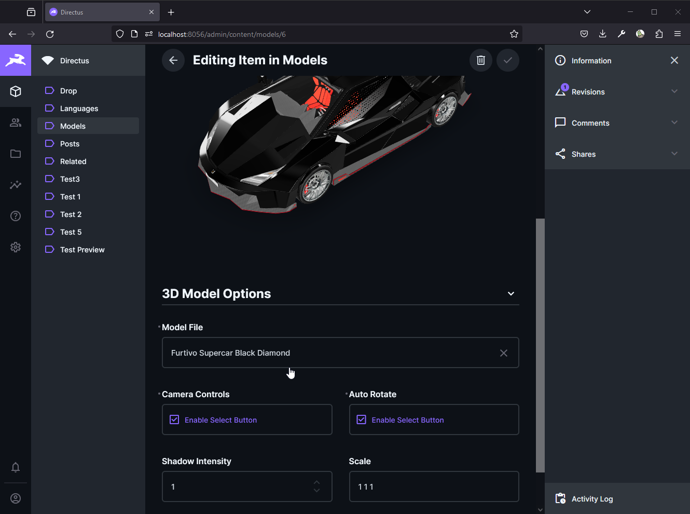

# Directus 3D Model Viewer

This extension embeds [`<model-viewer>`](https://modelviewer.dev/) into Directus as `interface`, `display`, `panel` andf `endpoint` (for use with live previews). These extensions will all render a 3d model in various places of the Directus UI.
All of the extensions expect the 3d model files to be uploaded to the Directus File storage.

> Note: I've only tested this with *.glb 3d files! It may work with other formats but no guarantees.

## Model Viewer Endpoint
With this endpoint you'll get a full page 3d model viewer which can be embedded as an iframe almost anywhere. The model viewer settings are configured based on url query parameters.

Camera Control | Auto Rotate
:-------------:|:---------------:
 | 

```http
GET /3d-viewer/viewer/<file-uuid>?options
```
#### Options:
- `camera_controls` boolean
- `auto_rotate` boolean
- `shadow_intensity` number
- `scale` string

#### Example
```http
GET /3d-viewer/viewer/bedfcb8b-1463-43e9-831e-45fd60f985f8
    ?camera_controls
    &auto_rotate
    &shadow_intensity=2
    &scale=2 2 2
```

### Usage for Live Preview


where the "3D Model" field is a "File" relationship (or an input with a valid file UUID will do too)

## Model Viewer Interface
This interface enables you to render 3d models on a Directus detail page. When setting values directly in the interface on an item detail page these will be leading and overwrite the set interface options.

Interface Options | Item Values
:----------------:|:---------------:
 | 
 | 

## Model Viewer Display
This display enables you to render 3d models on a Directus overview page. This takes a fair amount of resources so would not recommend this for pages with more than a few 3d model refrences.

Overview Page | Display Options
:------------:|:---------------:
 | 


## Model Viewer Panel
This panel enables you to render 3d models on a Directus insights panel.

Panel Example | Panel Options
:------------:|:---------------:
 | 
